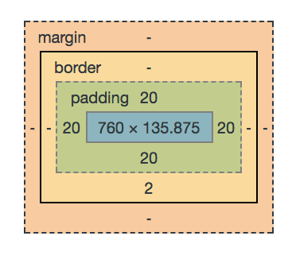

# CSS Box Model

---

### Every element on a webpage is basically a rectangle.

This is it's box - when we talk about the box model, we're talking about this box.

Pretty much all the layout properties affect this box, the size of it and where it is positioned.

Let's start with the basics.

---

### Every HTML element has a default set of styles

Let's have a look 👀

Dev tools - show styles.

### Let's try these properties

- `padding`
- `margin`
- `width`
- (sometimes) `height`
- both `min-` & `max-`
- `box-sizing`

Describe what each are - no need for height.

Show some padding on the header/article and box-sizing

Show these on inline

---

### Every element has a display property

Common default `display` values are `block` & `inline`

sectioning are block, text are inline

There are also media, table and list (item)

---

>The display property changes how the element behaves

---

>You can change the display property

What happens if I change an inline element to `display: block`

---

There is a `display: inline-block` best of both worlds

---

---

## The spec is changing

[https://developer.mozilla.org/en-US/docs/Web/CSS/display](https://developer.mozilla.org/en-US/docs/Web/CSS/display)

---

### Googling

- Totally cool
- Check at least 3-4 results
- Check date
- Don't believe w3schools (`-w3` in search query)
- Use Stack Overflow with caution

---

### Aside: Let's look at MDN

- Probably the most dependable learning resource
- [https://developer.mozilla.org/en-US/](https://developer.mozilla.org/en-US/)

---

Check the readme for the exercises