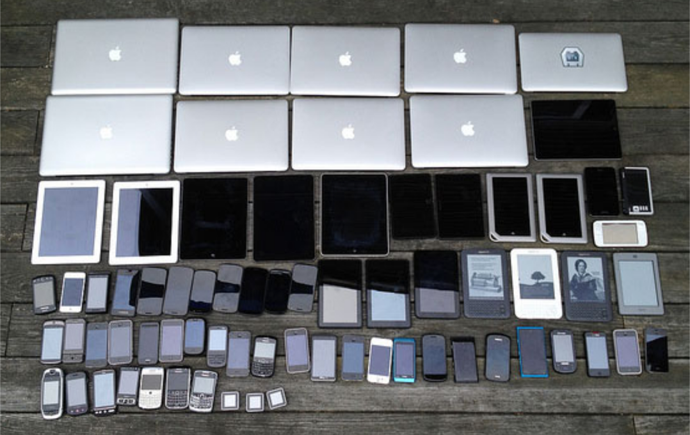

# Responsive & adaptive design

- Vast majority of websites are accessed by different devices rather than just a desktop these days
- How do we deal with this?

---



---

## Responsive

Responding to the environment

Making the webpage/app resize to it's device for instance

---

## Adaptive

Adapting to the device

Serving a different set of files for different set of devices or connections

I'm sure you seen 'mobile' sites - this is adaptive. We'll be looking into responsive on this course as it's uses a specific coding technique

---

### Designs that work in all environments:

- Screens
- Inside/outside
- Noisy/quiet
- Fibre/2G

---

- Demonstrate [Guardian](https://theguardian.com/uk)

---


### How?

- Use relative not absolute CSS units
- CSS Media Queries

#### There are other methods
- Is also JavaScript feature and device detection
    - https://modernizr.com/

Quickly demonstrate the tools available using the below code. The idea here is to start with the markup of a full page that hasn't received layout styling and to adjust the layout for mobile/desktop. Articles will be across 3 cols on desktop and 1 col linear on mobile. Nav hidden on mobile but shown on desktop.

```html
<header>
    <h1>SITE NAME</h1>
    <nav>
        <a href="">Home</a>
        <a href="">Products</a>
        <a href="">Blog</a>
    </nav>
</header>
<main>
    <section class="news-feed">
        <article>ARTICLE 1</article>
        <article>ARTICLE 2</article>
        <article>ARTICLE 3</article>
    </section>
</main>
<footer>FOOTER</footer>
```

Starting CSS
```css

  header {
    display: flex;
    justify-content: space-between;
  }

  nav {
    display: flex;
  }

```

---

### Media queries

Different types of media, like print

```css
@media print {

    * {
        background-color: transparent;
    }

}
```
---

### Breakpoints (viewport width)

```css
/* phone */
@media screen and (max-width: 500px) {

    #left-column {
        display: none;
    }

}
```

---

```css
/* Extra small devices (phones, less than 768px) */
@media screen and (max-width: 767px) { ... }

/* Small devices (tablets, 768px and up) */
@media screen and (min-width: 768px) and (max-width: 991px) { ... }

/* Medium devices (desktops, 992px and up) */
@media screen and (min-width: 992px) and (max-width: 1199px) { ... }

/* Large devices (large desktops, 1200px and up) */
@media screen and (min-width: 1200px) { ... }
```
---

### How do I see it?

You can move the screen width when devtools is open. There is also a mobile/tablet icon at the top, if you select this you can choose a number of screen sizes.

---

### Media

There's no point loading large images for small screens. Also how do you keep the aspect ratio you want and not the images?

---

#### Loading different pictures

You can use the `picture` element to load different image types and also different files based on screen size

```html
<picture>
    <source srcset="surfer.png" media="(min-width: 800px)">
    
</picture>
```

---

#### Object fit

You can use the `object-fit` property to display how the image appears in it's container.

```css
img {
    height: 100%; width: 100%;
    display: block;
    object-fit: contain;
}
```
