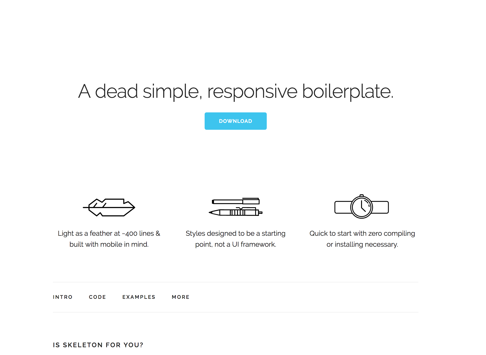
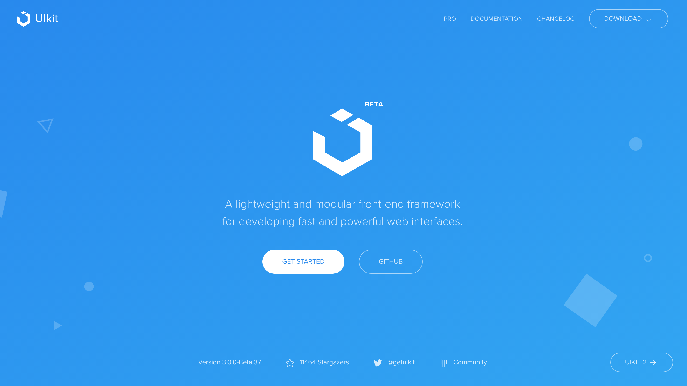
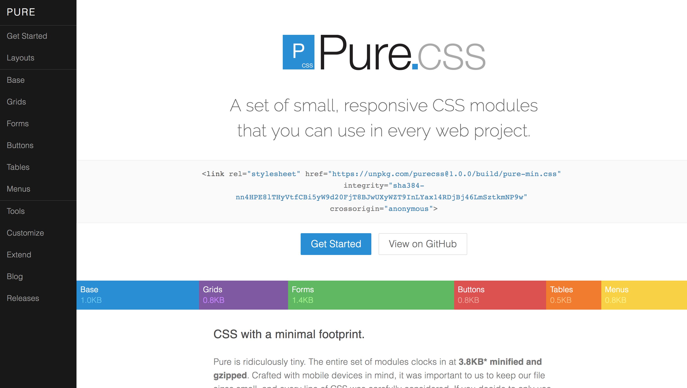

# Prototyping

> A _quick_ interactive workable solution

Can also be helpful to test technology

There is prototyping software to show interaction.

---
## Wireframing doesn't give you

- Interactivity

> Without the usability of something is can be hard to visualise

---

## Prototyping with front-end frameworks

Writing the markup/CSS for a nav every time is consuming, if you need to get something out of the door quickly then a framework can save you the time and hassle.

### Frameworks, libraries, APIs

A library is a collection of functions / objects that serves one particular purpose. you could use a library in a variety of projects.

A framework is a collection of patterns and libraries to help with building an application.

An API is an interface for other programs to interact with your program without having direct access.

---

To put it another way, think of a library as an add-on / piece of an application , a framework as the skeleton of the application, and an API as an outward-facing part of said app.

[http://programmers.stackexchange.com/questions/54451/library-vs-framework-vs-api](http://programmers.stackexchange.com/questions/54451/library-vs-framework-vs-api)

---

# So what is a framework now?

---

> "a collection of patterns and libraries"

I'm sure you've realised by now you can re-use the code you're writing

---

# There are loads of CSS Frameworks

---

### Bootstrap

---

### Tailwind

[Tailwind website](https://tailwindcss.com/)

---

### Foundation

---

### Skeleton

---

### Bulma

---

### UIkit

---

### Semantic

---

### Pure

---

### Milligram

---

# What

Collection of patterns

Reusable code

---

# Where

Not every framework is good for every project

- Prototyping
- Docs
- Quick win

---

# Why

So you don't have to do the work

---

# How

You include the code (probably a css file or files)

You use the given HTML

---
### Exercise:

Create a working prototype of a page using a CSS Framework

---

### Start by reading the docs

[https://getbootstrap.com/docs/4.0/getting-started/introduction/](https://getbootstrap.com/docs/4.0/getting-started/introduction/)

---

### Bootstrap under the hood

[https://github.com/twbs/bootstrap/tree/v4-dev/scss](https://github.com/twbs/bootstrap/tree/v4-dev/scss)

---

### Good

- Quicker (once you've learnt)
- Work done for you
- Kept up to date

---

### Bad

- Tied into a system, 'breaking out' is more work
- Bespoke styling is hard
- No control over support
- So. Much. Code!

---

